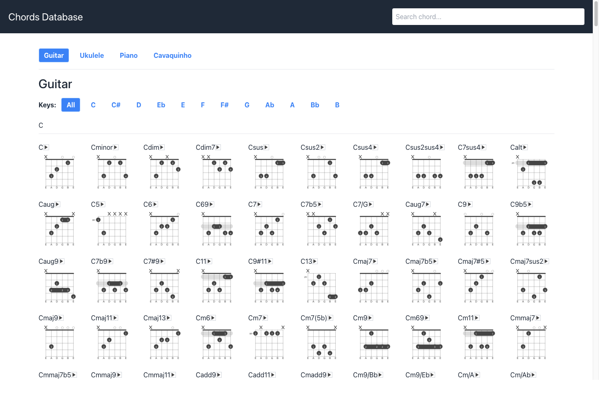
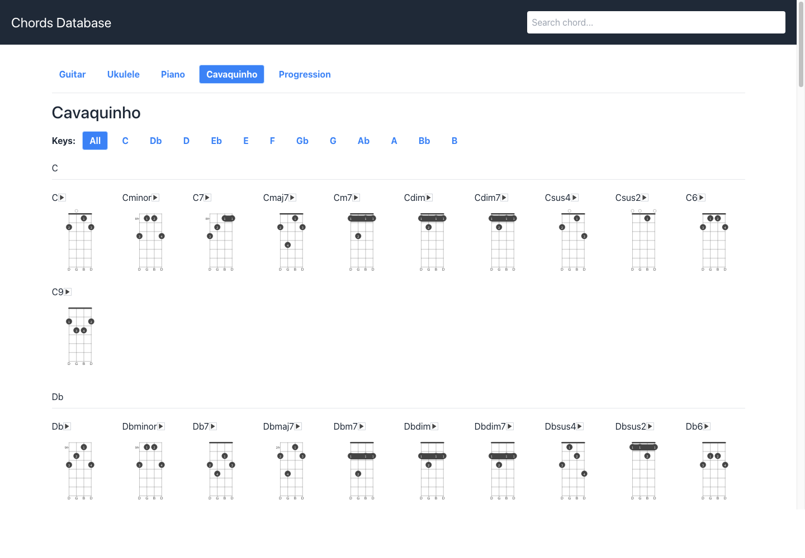
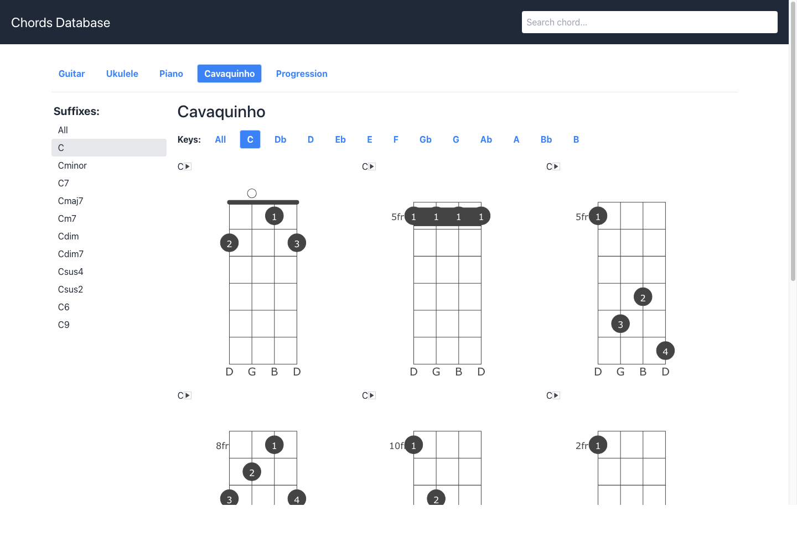
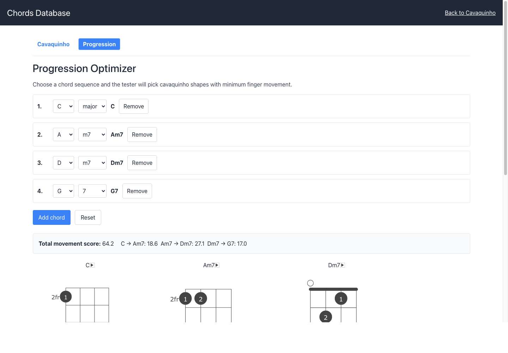
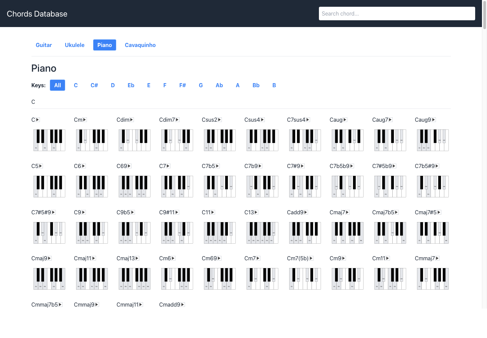

# react-chords

Biblioteca React para renderizar diagramas de acordes em SVG para instrumentos de cordas e piano, com um app de demonstração para navegar por acordes, posições e progressões.

## Sobre o Projeto

O `react-chords` facilita a criação de diagramas de acordes reutilizáveis em aplicações React. A biblioteca recebe a configuração do instrumento e a posição do acorde, e gera uma visualização em SVG pronta para ser exibida na interface.

Além da biblioteca principal, este repositório inclui um app de testes em `my-chords-tester` que usa a base [`chords-db`](https://github.com/tombatossals/chords-db) para demonstrar acordes de guitarra, ukulele, piano e cavaquinho.

## Principais Features

- Diagramas de acordes em SVG para interfaces React.
- Suporte a instrumentos de cordas com pestanas, dedos, cordas abertas e cordas abafadas.
- Visualização de piano para acordes baseados em notas.
- Navegação por instrumento, tonalidade e sufixo de acorde.
- Busca rápida por nome de acorde no app de demonstração.
- Suporte a cavaquinho com afinação `D G B D`.
- Otimizador de progressões para cavaquinho, escolhendo posições com menor movimento entre acordes.

## Demo / Screenshots

### Guitarra



### Cavaquinho



### Filtro por acorde



### Otimizador de progressões



### Piano



## Instalação

### Com NPM

```bash
npm install @tombatossals/react-chords
```

### Com Yarn

```bash
yarn add @tombatossals/react-chords
```

## Uso Básico

### Instrumento de cordas

```js
import Chord from '@tombatossals/react-chords'

const chord = {
  frets: [1, 3, 3, 2, 1, 1],
  fingers: [1, 3, 4, 2, 1, 1],
  barres: [1],
  capo: false
}

const instrument = {
  strings: 6,
  fretsOnChord: 4,
  name: 'Guitar',
  keys: [],
  tunings: {
    standard: ['E', 'A', 'D', 'G', 'B', 'E']
  }
}

export default function GuitarChord () {
  return (
    <Chord
      chord={chord}
      instrument={instrument}
      lite={false}
    />
  )
}
```

### Piano

```js
import Chord from '@tombatossals/react-chords'

const chord = {
  frets: ['C', 'E', 'G']
}

const instrument = {
  name: 'Piano'
}

export default function PianoChord () {
  return <Chord chord={chord} instrument={instrument} />
}
```

## App de Testes

O diretório `my-chords-tester` contém uma aplicação React usada para validar e demonstrar a biblioteca com dados reais de acordes.

### Fonte de dados do cavaquinho

O fluxo atual de cavaquinho neste repositório depende intencionalmente do fork `rezendehugo/chords-db`, não do upstream puro.

- Dependência travada no tester: `@tombatossals/chords-db` em `8352b25eec4a12c3747dfb69537bbd648b0394ad`
- Branch de referência para validação local: `codex/expand-cavaquinho-shapes`
- Repositório esperado ao lado deste projeto: `../chords-db`

Antes de validar mudanças de cavaquinho no `react-chords`, rode no repositório irmão:

```bash
cd ../chords-db
git checkout codex/expand-cavaquinho-shapes
npm test -- --runInBand src/db/cavaquinho.test.js src/db/cavaquinho.6.test.js
npm test -- --runInBand src/db/cavaquinho.derived-suffixes.test.js src/db/cavaquinho.suffix-metadata.test.js src/db/cavaquinho.suffix-contract.test.js
npm run build
```

Depois, volte para este repositório e valide o app de testes com o mesmo conjunto de dados:

```bash
cd my-chords-tester
npm install
npm test -- --watchAll=false
npm run build
```

Rotas principais:

- `#/guitar`: acordes de guitarra.
- `#/ukulele`: acordes de ukulele.
- `#/piano`: acordes de piano.
- `#/cavaquinho`: acordes de cavaquinho.
- `#/cavaquinho/:key/:suffix`: filtro por tonalidade e sufixo.
- `#/cavaquinho/progression`: otimizador de progressões.

O build do app de testes é gerado em `docs`, que pode ser publicado como site estático.

## Como Executar

Instale as dependências do projeto principal:

```bash
npm install
```

Rode a validação de estilo da biblioteca:

```bash
npm run standard
```

Gere o build da biblioteca em `lib`:

```bash
npm run build
```

Para executar o app de testes:

```bash
cd my-chords-tester
npm install
npm start
```

Para rodar os testes do app:

```bash
cd my-chords-tester
npm run test
```

Para gerar o site estático em `docs`:

```bash
cd my-chords-tester
npm run build
```

## Tecnologias

- React
- SVG
- Create React App
- React Router
- Tailwind CSS no app de testes
- [`chords-db`](https://github.com/tombatossals/chords-db)

## Status do Projeto

O projeto está em evolução ativa, com foco especial em ampliar e validar os acordes de cavaquinho, melhorar a experiência do app de demonstração e refinar o otimizador de progressões.

## Licença

MIT
